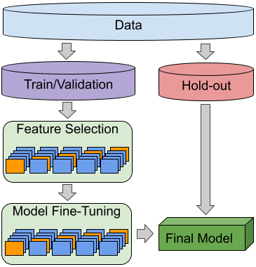

# SAMLP: Semi-Automatic Machine Learning Pipeline.

Current repository provides implementation of Semi-Automatic Machine Learning Pipeline that was initially developed under the research project of Twitter Bot detection with title: "BotArtist: Twitter bot detection Machine Learning model based on Twitter suspension" [Arxiv Paper](https://arxiv.org/abs/2306.00037).
Developed Machine Learning Pipeline allow to utilize without any significant adaptation, where only set of model hyperparameters require changes in order to avoid over/under-fitting due the solution complexity.

## Implementation

The SAMLP provide the entire machine learning pipeline, including:
 - Data train/test split
 - Feature selection
   - Base on the Lasso model
   - Including dynamic alpha hyperparameter searching
   - Class imbalance consideration during the feature selection
   - K-Fold Cross validation
 - Classification (binary/multiclass) hyperparameter fine-tuning
   - Models: XGBoost, RandomForest, GNB
   - Consideration of the class imbalance 
   - K-Fold Cross validation
   - F1 performance measurement due the class imbalance 
 - Decision thresholding fine-tuning (binary only)
 - Statistics of the model performances
 - Final model explainability
 - The resulting model is finally trained ove ALL data and stored as pkl file



## Requirements
Installation of required packages:
```bash
python3.9 -m pip install -r requirements.txt
```

For the utilization, please change the proper file names in the *configuration.py* file, providing the proper initial input filename, located in the *data/* folder .
```angular2html
├── README.md
├── configuration.py
├── pipeline.py
├── requirements.txt
└── utilities
    ├── DataLoading.py
    ├── feature_selector.py
    ├── model_selector.py
    ├── model_wrapper.py
    ├── mongoConfig.py
    ├── mongoConnector.py
    └── plotting.py
└── data (Required for data storage)
└── plots
└── stats (Required to store the statistics)
```

## Model Explainability
As model explainability we utilize well known SHAP game theoretical approach. Such methodology allow to provide important insights of the model captured difference between the sample classes (binary and multi-class). 

## Citation and contact:

Alexander Shevtsov: shevtsov[at].csd.uoc.gr

Citation:
````angular2html
@article{shevtsov2023botartist,
  title={BotArtist: Twitter bot detection Machine Learning model based on Twitter suspension},
  author={Shevtsov, Alex and Antonakaki, Despoina and Lamprou, Ioannis and Pratikakis, Polyvios and Ioannidis, Sotiris},
  journal={arXiv preprint arXiv:2306.00037},
  year={2023}
}
````
